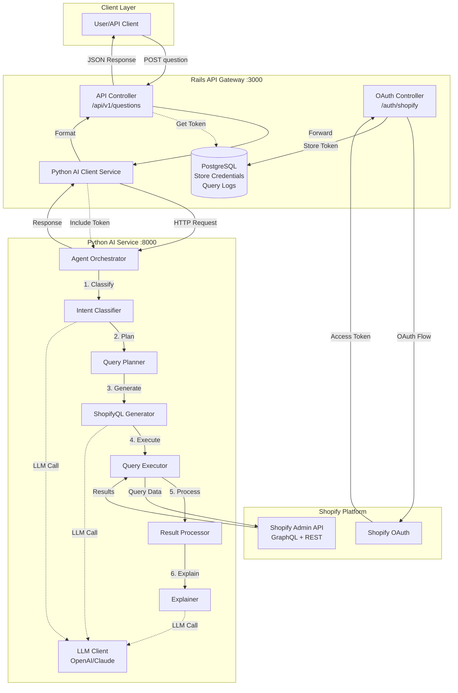
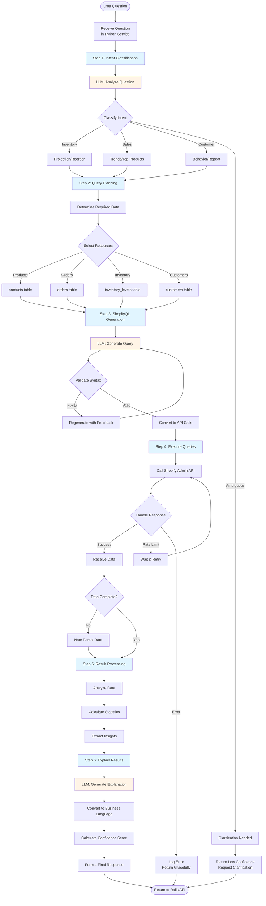
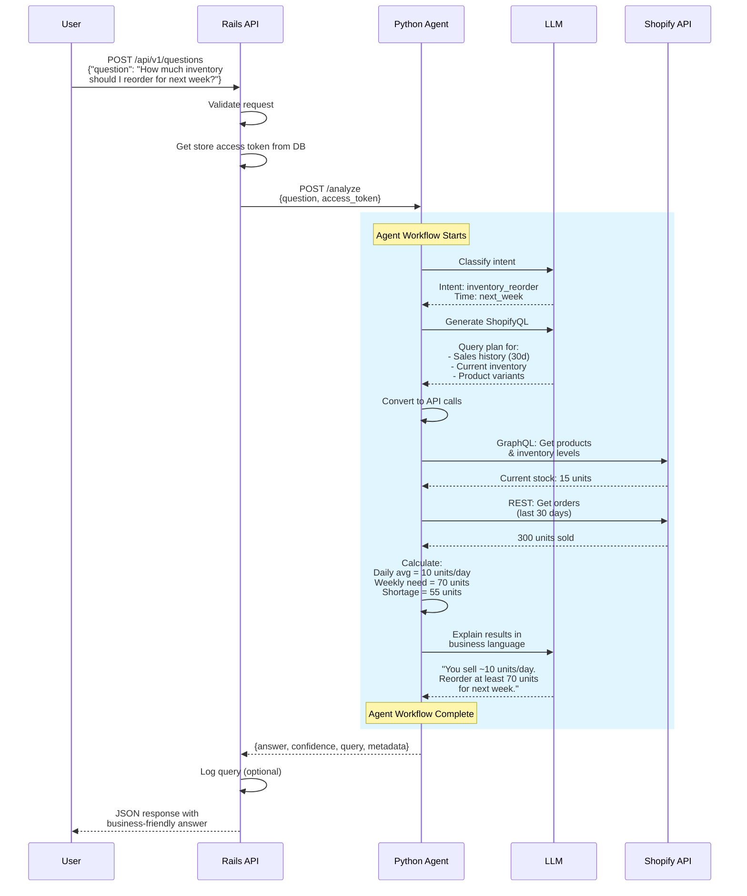
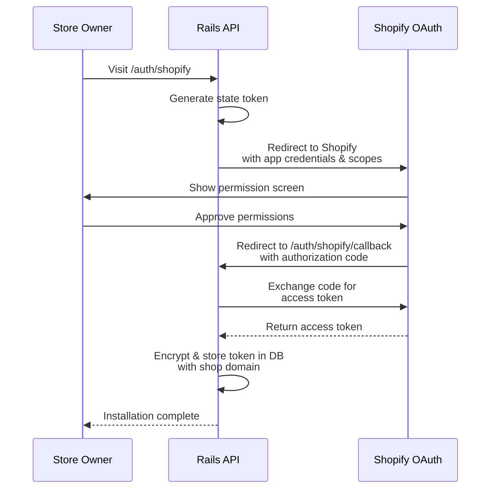

# Shopify Analytics App - Architecture Diagrams

## System Architecture Overview

## Agentic Workflow - Detailed Flow

## Data Flow Example: "How much inventory to reorder?"

## OAuth Flow

## Component Responsibilities

### Rails API Gateway
- **Primary Role**: Entry point and orchestrator
- **Responsibilities**:
  - Accept and validate user questions
  - Manage Shopify OAuth and tokens
  - Forward requests to Python service
  - Format and return responses
  - Optional: Log queries for analytics

### Python AI Service
- **Primary Role**: LLM-powered agent system
- **Responsibilities**:
  - Interpret natural language questions
  - Generate appropriate Shopify queries
  - Execute queries against Shopify API
  - Process and analyze results
  - Generate human-friendly explanations

### Shopify Platform
- **Primary Role**: Data source
- **Provides**:
  - OAuth authentication
  - Admin API (GraphQL & REST)
  - Store data (products, orders, customers, inventory)

## Technology Stack Summary

| Layer | Technology | Port | Purpose |
|-------|-----------|------|---------|
| API Gateway | Ruby on Rails 7 | 3000 | Request handling, auth, orchestration |
| AI Service | Python FastAPI | 8000 | LLM agent, ShopifyQL generation |
| Database | PostgreSQL | 5432 | Store credentials, query logs |
| LLM Provider | OpenAI GPT-4 | N/A | Natural language processing |
| Data Source | Shopify Admin API | N/A | Store data access |

## Key Design Decisions

### Why Rails + Python?
- **Rails**: Mature OAuth support, great for API gateway patterns, strong ecosystem for Shopify
- **Python**: Superior LLM libraries, better AI/ML tooling, easier prompt engineering

### Why Separate Services?
- **Separation of Concerns**: Business logic (Rails) vs AI logic (Python)
- **Independent Scaling**: Can scale AI service independently
- **Technology Strengths**: Use each language for what it does best
- **Development**: Teams can work independently

### ShopifyQL Approach
- **Challenge**: ShopifyQL is primarily for Shopify Admin UI
- **Solution**: LLM generates ShopifyQL-like intent, we convert to Admin API calls
- **Benefit**: Leverage LLM's understanding of query languages while using supported APIs

### Agent Architecture
- **Multi-step Pipeline**: Clear separation of intent, planning, execution, explanation
- **LLM Integration Points**: Only where reasoning is needed (intent, query gen, explanation)
- **Deterministic Steps**: Data fetching and processing use standard code
- **Validation**: Multiple checkpoints ensure quality
